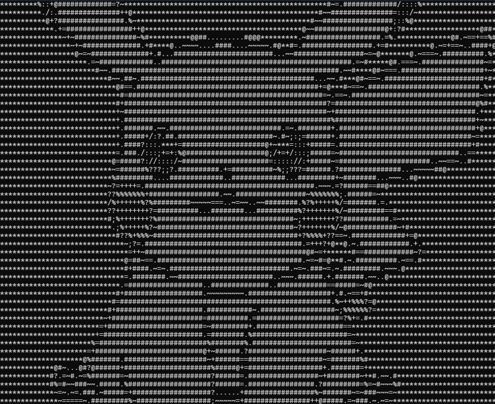

# ImAscii

ImAscii is a **CLI program that generates ASCII art from images**. Here's how it works;
you drag the image onto the program when it says "Open with ImAscii", then you can release.

---
# Functions and future updates

Currently, the only thing ImAscii does is turn images into ASCII and save it in a .txt file,
future updats will be:

- Animation, like [ascii-live!](https://github.com/hugomd/ascii-live)
- Colour support
---

# Representation of ImAscii:

This is **pikachu, rendered in Imascii**.